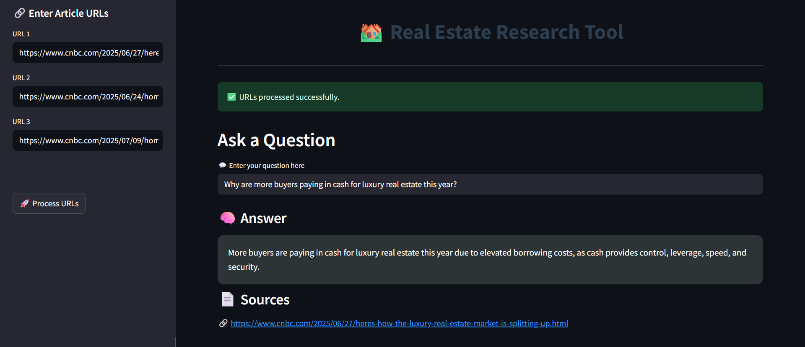

# 🏘️ Real Estate Research Tool

A user-friendly web application developed using Streamlit that enables fast and insightful real estate research. Users can enter news article URLs and ask questions to receive answers grounded in the actual content using RAG (Retrieval-Augmented Generation). Though focused on real estate, this tool can be extended to any domain with textual sources.

---

## 🎥 Presentation
Watch the full project presentation here: **[Real Estate Research Tool Presentation](https://vaibhav-projects.my.canva.site/real-estate-research-tool)**

---

## 🛠 Features  
- Visually enhanced and interactive UI built with Streamlit. 
- Input multiple real estate article URLs and extract meaningful insights.  
- Uses BeautifulSoup to scrape news content from provided URLs.
- Text is chunked and embedded using HuggingFace’s MiniLM model.
- Stores embeddings in ChromaDB for efficient semantic search.  
- Generates answers using Llama3 models via Groq API.  
- Displays answer and source links for transparency.  
- Easily extendable to other domains (e.g., finance, politics).

---

## 📂 Project Structure

```
Real_Estate_Research_Tool/
│
├── resources/
│   ├── vectorstore/             # Local DB directory (Chroma) 
│
├── main.py                      # Streamlit app logicc
├── rag.py                       # RAG logic: scraping, embedding, answering
├── LICENSE                      # Apache License file
├── requirements.txt             # List of dependencies
└── README.md                    # Project documentation
```

---

## 🚀 How to Run Locally  
### Prerequisites:  
- Python 3.8+

1. **Clone the repository**:
   ```bash
   git clone https://github.com/vaibhavgarg2004/Real-Estate-Research-Tool.git
   cd Real-Estate-Research-Tool
   ```
2. **Install dependencies**:   
   ```commandline
    pip install -r requirements.txt
   ```
3. **Set up your environment variables**:
    ```text
    GROQ_API_KEY=GROQ_API_KEY_HERE
   ```
5. **Run the Streamlit app**:   
   ```commandline
    streamlit run main.py
   ```

---

## 🧠 How It Works

1. **URL Input & Scraping**  
   - Users enter up to 3 article URLs in the sidebar.  
   - HTML content is scraped using requests and BeautifulSoup.   

3. **Processing & Storage**  
   - Articles are split into chunks using LangChain’s RecursiveCharacterTextSplitter.  
   - Chunks are embedded using sentence-transformers/all-MiniLM-L6-v2.  
   - Stored in ChromaDB for vector-based semantic retrieval.
     
---
   
## 🖼️ Application Snapshot



---

## 📄 License
This project is licensed under the **Apache License 2.0**. See the [LICENSE](./LICENSE) file for details.

---

*Research real estate trends effortlessly — grounded in real data.*

